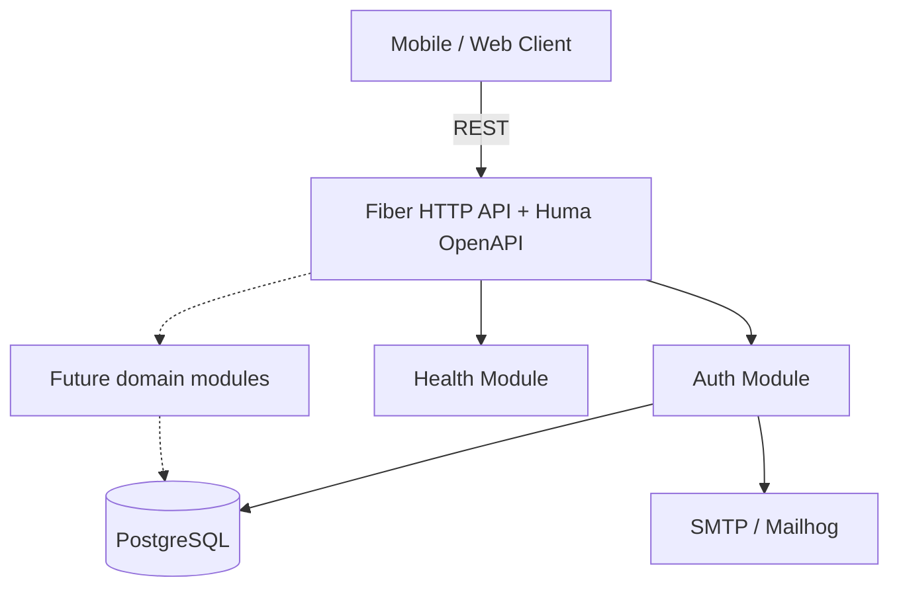
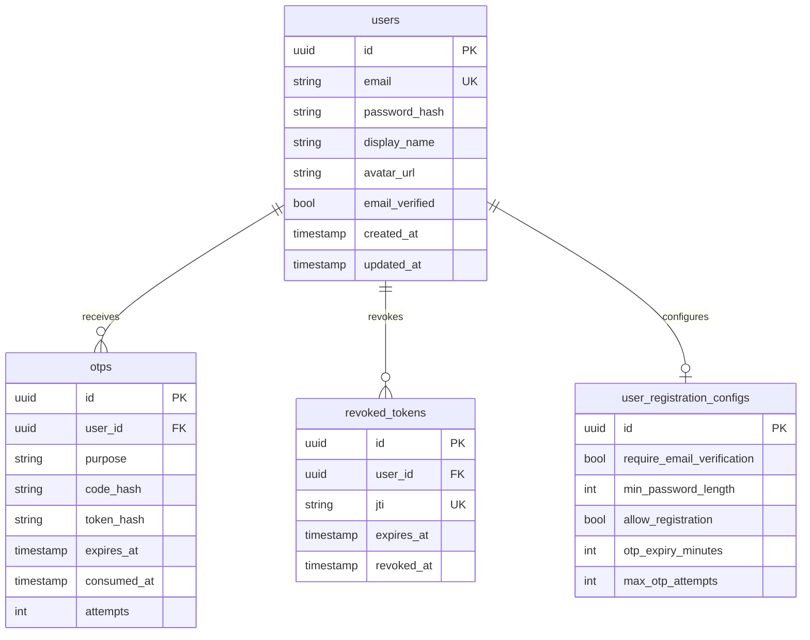

# go.boilerplate — Design Document

##### Author: LFSCamargo

## Introduction

**go.boilerplate** is a production-ready **Go HTTP API starter**. Clone it, rename the module, and add domain modules — auth, email, Docker, OpenAPI, logging, and AI quality gates are already in place.

The stack and layout were proven in [go.chat](https://github.com/LFSCamargo) and extracted here so new services do not re-solve the same baseline.

### Problem statement

Standing up a new Go service typically means reimplementing:

- User registration, JWT sessions, logout/revocation
- Email verification and password recovery
- PostgreSQL migrations and a clear module layout
- Docker Compose for local and production-like runs
- OpenAPI docs, structured logging, and AI-agent conventions

The starter must stay **modular**, **testable**, and **AI-friendly** so product features can be added without regressions or architectural drift.

### Product scope (v1)

| In scope | Out of scope |
|----------|--------------|
| User registration, login, logout | Product-specific domains (chat, billing, …) |
| Email verification & password recovery (OTP + magic link) | GraphQL |
| Avatar upload on register | Video / voice (WebRTC) |
| Token invalidation (logout / revoke) | End-to-end encryption |
| Health check + Huma OpenAPI playground | Federated / multi-tenant SaaS |
| React Email + SMTP | Mobile / web client (separate repo) |
| Docker Compose (dev Air reload / prod) | Admin / moderation panel |
| AI quality gates (Cursor, Claude, Codex, CI) | Multi-region / Redis scale-out (v2) |

## Potential Solutions

### Backend framework

| Approach | Pros | Cons | Effort |
|----------|------|------|--------|
| **Fiber v3 + modular routers** (chosen) | Fast, familiar HTTP API, easy module split | Not stdlib `net/http` | Low |
| GraphQL | Flexible client queries | Heavier stack, harder AI codegen | Medium |
| stdlib `net/http` + chi | Minimal deps | More wiring per handler | Medium |

**Decision:** Fiber v3 with `src/modules/*` (router + handlers + services + repositories). Keeps handlers small for AI edits.

### Persistence

| Approach | Pros | Cons |
|----------|------|------|
| **PostgreSQL + GORM** (chosen) | Relational constraints, familiar migrations | N+1 risk if queries are careless |
| MongoDB | Flexible documents | Weaker relational constraints |

**Decision:** PostgreSQL 16, GORM models, SQL migrations via golang-migrate. Explicit Preload/Joins rules enforced by AI checks.

### Email

| Approach | Pros | Cons |
|----------|------|------|
| **React Email + SMTP** (chosen) | Previewable templates, Mailhog in dev | Requires Node for render |
| Go `html/template` only | No Node | Weaker design-to-code path |

**Decision:** Templates in `emails/emails/go_boilerplate/`; Go calls `npm run render` then SMTP.

## Assumptions

- Single-region deployment initially (Docker Compose locally, one cloud region in prod).
- Clients authenticate with **Bearer JWT**; secret from env (`BEARER_SECRET`).
- Email delivery uses SMTP (Mailhog in dev).
- OTP codes are short-lived (10 min) and single-use.
- Users are identified by unique email (lowercase normalized); display name is optional.
- New product features live in new `src/modules/<name>` packages, not in `auth` or `health`.

## Constraints / Limitations

- No product domain in the starter — only auth + health.
- No offline sync protocol.
- No admin panel in v1.
- No cross-region replication in v1.
- Redis is not required in v1 (in-process rate limits only).

## System Design and Architecture

### System diagram



### Terminology

| Term | Meaning |
|------|---------|
| **Module** | Domain package under `src/modules/<name>` with router, handlers, services, repositories |
| **OTP** | One-time password/code for email verify / password reset |
| **Revoked token** | JWT ID (`jti`) stored until expiry to block reuse after logout |
| **Registration config** | Singleton policy row (min password length, OTP expiry, whether signup is open) |
| **Brand name** | Display copy **Go Boilerplate** — never the module path `go.boilerplate` |

### Hard and soft dependencies

| Dependency | Type | Impact if down |
|------------|------|----------------|
| PostgreSQL | Hard | All reads/writes fail; API unhealthy |
| SMTP | Soft | Auth emails/OTP fail; login still works for verified users |

### Main component flows

#### Register + verify email (happy path)

```
1. Client POST /api/v1/auth/register { email, password, … }
2. Service creates user, hashes password (bcrypt 12), issues JWT
3. Persist hashed OTP + optional magic-link token
4. Send verify email via React Email + SMTP
5. Client POST /api/v1/auth/verify-email-code { code } (Bearer) or GET /api/v1/auth/verify-email?token=
6. Mark email_verified, consume OTP
```

#### Login + logout

```
1. POST /api/v1/auth/login { email, password }
2. Issue JWT (sub, jti, exp); unverified users still get a session and a resent verify email
3. Protected routes: middleware.RequireAuth / RequireHumaAuth load user, reject revoked jti
4. POST /api/v1/auth/logout inserts jti into revoked_tokens until exp
```

### Service guarantees

- **ACID:** Auth writes that must stay consistent (user + OTP, logout revoke) run in transactions where needed.
- **Auth tokens:** Stateless JWT with `jti`; logout inserts into `revoked_tokens` until `exp`. Protected routes use `src/middleware.RequireAuth`, which loads the user and stores it on the Fiber context for any module's handlers.
- **OTP:** Hashed at rest; max 5 attempts; expires in 10 minutes (policy from `user_registration_configs`).
- **Recovery:** DB backups manual in v1.

### Data definition, schema design and Persistence

#### Entity relationship (logical)



#### GORM models (location: `src/db/models/`)

| Model | Table | Status |
|-------|-------|--------|
| `User` | `users` | Implemented |
| `UserRegistrationConfig` | `user_registration_configs` | Implemented (singleton policy row) |
| `RevokedToken` | `revoked_tokens` | Implemented |
| `OTP` | `otps` | Implemented |

Add product tables with skill `create-db-entity` — do not overload auth models.

#### Database domain (`src/db/`)

```
src/db/
├── db.go                 # GORM Postgres connection
├── migrate.go            # golang-migrate runner (embedded SQL)
├── migrations/           # NNNNNN_name.up.sql / .down.sql
└── models/               # GORM entities + registry
```

**Migrations (local):**

```bash
make up-dev-deps             # Postgres + Mailhog (dev overlay)
make db-migrate              # apply all pending
make db-migrate-version      # inspect version
make db-new-entity NAME=...  # scaffold + migrate (see create-db-entity skill)
```

**Docker Compose modes:**

| Command | Compose file | What runs |
|---------|---------|-----------|
| `make up-dev` | `docker-compose.dev.yml` | nginx `:8080` → app `:5000` (Air live reload), Postgres (host `:5432`), Mailhog (`:1025` / UI `:8025`) |
| `make up-dev-deps` | same | Postgres + Mailhog only (use with `make run` or `make run-dev`) |
| `make run-dev` | host | Air live reload against local Go (`install-deps` installs Air) |
| `make down-dev` | same | Stop the dev project (`goboilerplate-dev`) |
| `make up-prod` | `docker-compose.prod.yml` | nginx `:8080` → app `:5000`, Postgres on the compose network; SMTP from `.env` |
| `make down-prod` | same | Stop the prod project (`goboilerplate-prod`) |

`make up-dev` runs the Go API on port **5000** inside Docker with [Air](https://github.com/air-verse/air) (`.air.toml`, `poll = true` for Docker Desktop, colorized logs for dark terminals). **nginx** listens on **8080** and reverse-proxies to the app. Saving a `.go` file under `src/` rebuilds `./tmp/server` and restarts the process. Email templates are bind-mounted and re-rendered on the next send without a Go rebuild.

Production `make up-prod` requires `BEARER_SECRET`, `CORS_ORIGINS`, `SMTP_HOST`, `MAIL_FROM`, `EMAIL_ASSETS_BASE_URL`, and `APP_PUBLIC_URL` in `.env`. Do not reuse the sample bearer secret.

**New entities:** use Cursor skill `create-db-entity` or `scripts/db/new-entity.sh`.

#### Email (`src/mail/` + `emails/`)

| Layer | Location | Role |
|-------|----------|------|
| React Email templates | `emails/emails/go_boilerplate/*.tsx` | Go Boilerplate emails (Protocol from Figma; verify + password reset) |
| Static email assets | `emails/static/go_boilerplate/` | Logo, hero, social icons (canonical). `email dev` also needs `emails/emails/static` (`make emails-dev` symlinks it). |
| Renderer adapter | `src/mail/reactemail/` | Calls `npm run render` with template + JSON props |
| SMTP adapter | `src/mail/smtp/` | Sends HTML via Mailhog/prod SMTP |
| Mail service | `src/mail/service.go` | `SendVerifyEmail`, `SendPasswordReset` |

```bash
make emails-install          # npm install in emails/
make emails-dev              # preview at http://localhost:3001 (go_boilerplate/*)
make emails-render TEMPLATE=password_reset PROPS='{"code":"123456","name":"Ada","companyName":"Go Boilerplate"}'
```

SMTP modes via `SMTP_SECURITY`: `none` (Mailhog), `starttls`, `tls`.

#### Logging (`src/log/`)

Pino-inspired structured logging on Go `slog`:

| Env | Default (dev) | Role |
|-----|---------------|------|
| `LOG_LEVEL` | `info` | `debug`, `info`, `warn`, `error` |
| `LOG_FORMAT` | `pretty` | `pretty` (colored, human-readable) or `json` (prod) |

- **Redaction:** passwords, tokens, JWTs, OTP codes, Authorization headers, DB/SMTP secrets; emails masked (`a***@example.com`); sensitive query params (`token`, `code`) stripped from request logs.
- **HTTP:** Fiber middleware logs `method`, redacted `path`, `status`, `duration_ms`, `ip` — never raw bodies or Bearer tokens.

```go
import applog "go.boilerplate/src/log"

applog.Info("user registered", "email", user.Email) // email masked automatically
```

#### OpenAPI (`src/openapi/`)

Huma on Fiber v3 (see the [Fiber OpenAPI recipe](https://docs.gofiber.io/recipes/openapi/)):

| URL | Role |
|-----|------|
| `http://localhost:8080/docs` | Scalar playground (dark theme) |
| `http://localhost:8080/openapi.json` | OpenAPI 3.1 JSON |
| `http://localhost:8080/openapi.yaml` | OpenAPI 3.1 YAML |

Protected operations use the `BearerAuth` scheme. Click **Authorize** in `/docs` after logging in.

### Caching requirements

- v1: no cache; rely on Postgres indexes. Auth rate limits are in-process (per instance).
- v2 (optional, per product): Redis for shared rate limits and session-adjacent hot keys.

### Capacity planning

- Target: a single API instance is enough for early product traffic.
- Retention: users, OTPs (until expiry/consume), revoked tokens until `expires_at`.
- Indexes: unique email on `users`; unique `jti` on `revoked_tokens`; `(user_id, purpose)` on `otps`.

### Performance requirements

- P95 REST latency &lt; 200ms for auth/health on local/dev hardware.
- Avoid N+1: use GORM `Preload` / joins; enforced by AI N+1 checker.

### Security

- **PII:** email, display name — store email unique, lowercase normalized.
- Passwords: bcrypt cost 12.
- JWT: HS256, include `sub`, `jti`, `exp`; validate revocation on every protected route.
- OTP: store SHA-256 hash only; rate limit auth abuse endpoints (login, signup, reset, OTP).
- CORS from env; no secrets in repo (gitleaks enforced).

### Multi region story

- v1: single region only.
- v2: read replicas + shared rate-limit store if a product needs it.

## API Endpoints

Base path: `/api/v1`

### Auth (`/auth`)

| Method | Path | Description |
|--------|------|-------------|
| POST | `/register` | Create account (optional `picture` multipart), send verify email |
| POST | `/login` | Issue JWT (includes unverified sessions; resends verification email) |
| POST | `/logout` | Revoke current `jti` (Bearer JWT required) |
| POST | `/recover-password` | Send reset email (OTP + link) |
| POST | `/reset-password` | Reset with OTP `code` or magic-link `token` |
| POST | `/verify-email` | Resend verify email (**Bearer JWT required**) |
| GET | `/verify-email?token=` | Confirm email via magic-link token (public, rate limited) |
| POST | `/verify-email-code` | Confirm email with OTP (**Bearer JWT required**) |
| GET | `/me` | Current user from Bearer JWT |

Routes are registered with [Huma](https://huma.rocks/) on Fiber v3 (`src/openapi`). Local playground: `http://localhost:8080/docs` (Scalar, dark theme). Specs: `/openapi.json`, `/openapi.yaml`. Auth request bodies are still checked with Zog schemas in `types/requests`. Protected ops use `middleware.RequireHumaAuth` (Bearer JWT). Avatar files are stored by `UserRepository.SaveAvatar`.

### Health

| Method | Path | Description |
|--------|------|-------------|
| GET | `/health` | Liveness (`{"status":"ok"}`, Zog `HealthSchema`) |
| GET | `/docs` | OpenAPI playground (Scalar, dark theme) |
| GET | `/openapi.json` | OpenAPI 3.1 spec |

## Rollout Plan

1. **Phase 0** — Auth (signup with picture, login, OTP + magic-link verify, password reset) + health + Docker + email + AI gates (**current / complete for the starter**)
2. **Phase 1+** — Product modules in consuming repos (`src/modules/<domain>`), extra entities via `create-db-entity`
3. **Hardening (optional)** — shared rate limits, Redis, load tests when a product needs them

## Test Plan

- **Unit:** handlers with mocked services; Zog schema validation tests.
- **Integration:** `testcontainers-go` / local Postgres on repository tests (`POSTGRES_CONNECTION`).
- **Regression:** every bug fix adds a failing test first.
- **AI gate:** `make ai-check` before merge — tests, complexity, security, docs sync.
- **CI:** GitHub Actions workflow `.github/workflows/ci.yml` runs on pull requests and pushes to `main` (`make test`, `make build`, `make ai-check` with Postgres + semgrep/gitleaks/deadcode).

## Appendix

- Origin stack: extracted from **go.chat** (same Fiber/Huma/auth/email/AI-gate layout).
- Template: `templates/TEMPLATE_DOC.md`
- AI development: `AGENTS.md`, `ai/README.md`
- Email design: [SaaS Email Templates (Figma Community)](https://www.figma.com/community/file/1626680546446620209/saas-email-templates) (Protocol)

## Review Sign-Off

### Internal Review

- **Team lead/manager:** _Sign-off by _
- **Sponsor:** _Sign-off by _

**Target sign-off:** no later than _09/16/2026 (Tue)_.

**[Sign-off Completed on]** _
